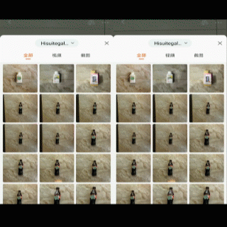
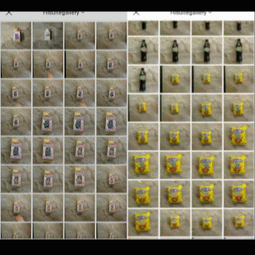

# PerceptualAttentionalBiasedAttack


## Demos

Demos on Taobao platform

  

Demos on JD platform

  


## To Perform Attacks

### Requirement

```
torch=1.7.1
torchvision=0.8.2
```

### Generate a Perceptual biased Patch Prior

With the RPC dataset and the ground truth of hard examples, you can generate a patch prior by running the following code. The results are in the new dir `logs/prior*`. `logs/prior*/prior_best.pkl` is the best prior. `grad_cam.py` will crop the best prior to size of 32 * 32. 

```shell
cd ./src
python gen_prior.py --model=[model type] --model_path=[path to your finetuned model] --wrong_file=[file to hard examples] --data_path=[path to cropped RPC dataset]
python grad_cam.py --model=[model type] --model_path=[path to your finetuned model] --input=[path to the best prior] --output=[path to save the result]
```

Hard examples refer to samples that was misclassified by your model.

### Train an Adversarial Patch

With the RPC dataset and the generated prior, you can generate a adversarial patch by running the following code.

```shell
cd ./src
python gen_patch.py --model=[model type] --model_path=[path to your finetuned model] --train_file=[file to train set] --data_path=[path to cropped RPC dataset] --patch_raw=[file to the generated prior]
```

### Real World Attacks

To perform attacks in real world, you can use a color printer to print out the patch and stick it on items to attack, and then take pictures with a camera to get adversarial examples.